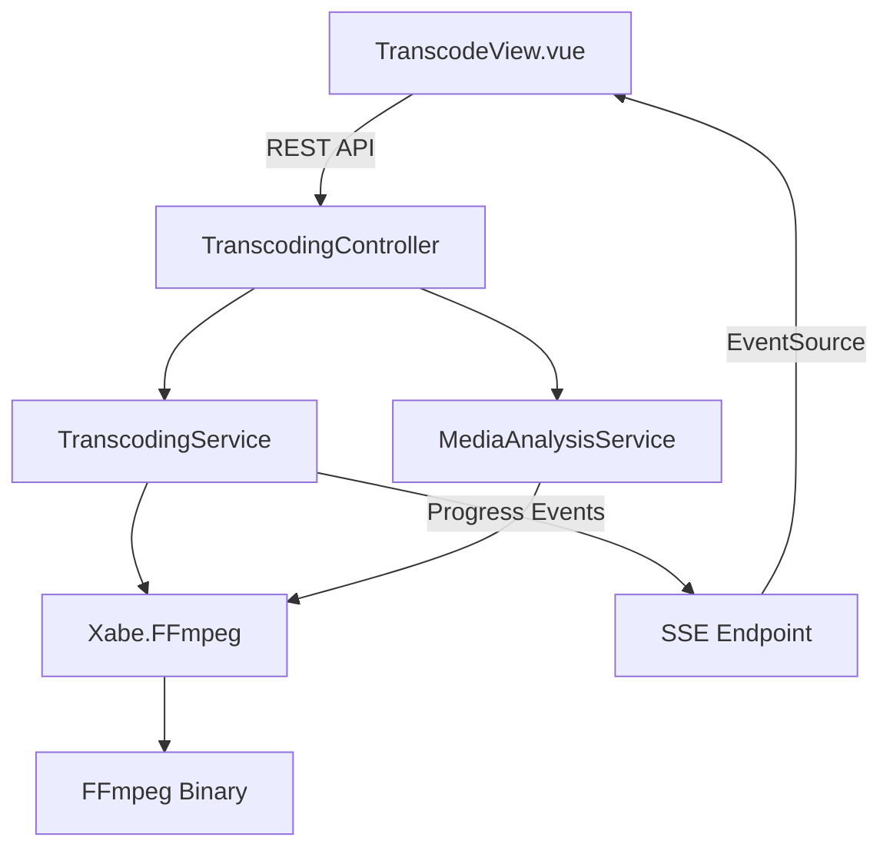

# Phase 11: H.265 Transcoding Engine

Add a complete H.265 (HEVC) transcoding pipeline with quality presets, file size prediction, browser preview, and hardware acceleration support.

## User Review Required

> [!IMPORTANT]
> This is the largest feature yet. It adds **6 new backend files**, **1 new Vue page**, a **database migration**, and a **new nav route**. Review the scope carefully before approving.

> [!WARNING]
> **Browser preview** uses FFmpeg to generate a short low-res clip (first 15 seconds) served via a streaming endpoint. Full live-transcoding preview in-browser is not feasible without a dedicated streaming server, so we use a "sample clip" approach instead.

> [!CAUTION]
> File size prediction is an **estimate** based on bitrate × duration × compression ratio for the chosen CRF/preset. Actual sizes may vary ±15% depending on source content complexity.

---

## Architecture Overview



---

## Proposed Changes

### Backend Models

#### [NEW] [TranscodeJob.cs](file:///f:/DEV/besa/MovieManager/Backend/Models/TranscodeJob.cs)
In-memory model for an active transcode job (no DB persistence needed):
- `string JobId` — GUID
- `string SourcePath`, `string OutputPath`
- `double ProgressPercent`, `string Status` (Queued / Running / Done / Failed)
- `long EstimatedOutputBytes`, `long ActualOutputBytes`
- `TranscodeSettings Settings` — nested object

#### [NEW] [TranscodeSettings.cs](file:///f:/DEV/besa/MovieManager/Backend/Models/TranscodeSettings.cs)
- `string QualityPreset` — "fast", "balanced", "quality" (maps to CRF 28/23/18)
- `int? CustomCrf` — optional override (0–51)
- `string HwAcceleration` — "qsv" (default), "nvenc", "amf", "software"
- `string OutputCodec` = "hevc" *(future: av1)*
- `bool CopyAudio` = true *(passthrough audio by default)*
- `string? TargetResolution` — null = keep original, or "1080p" / "720p"

#### [MODIFY] [ConfigurationSetting.cs](file:///f:/DEV/besa/MovieManager/Backend/Models/ConfigurationSetting.cs)
- Add `string DefaultHwAccel { get; set; } = "qsv";`

#### [MODIFY] [MediaAnalysisResult.cs](file:///f:/DEV/besa/MovieManager/Backend/Models/MediaAnalysisResult.cs)
- Add `long FileSizeBytes`, `double DurationSeconds`, `long VideoBitrate`, `long AudioBitrate` — needed for size prediction math.

---

### Backend Services

#### [NEW] [ITranscodingService.cs](file:///f:/DEV/besa/MovieManager/Backend/Services/Interfaces/ITranscodingService.cs)
```csharp
Task<TranscodeJob> StartTranscodeAsync(string filePath, TranscodeSettings settings);
TranscodeJob? GetJobStatus(string jobId);
Task<string> GeneratePreviewClipAsync(string filePath); // returns URL
long EstimateOutputSize(MediaAnalysisResult analysis, TranscodeSettings settings);
```

#### [NEW] [TranscodingService.cs](file:///f:/DEV/besa/MovieManager/Backend/Services/TranscodingService.cs)
Core engine implementation:

| Feature | Implementation |
|---|---|
| **Quality Presets** | "fast" → CRF 28 + `veryfast`, "balanced" → CRF 23 + `medium`, "quality" → CRF 18 + `slow` |
| **HW Accel** | `qsv` → `hevc_qsv`, `nvenc` → `hevc_nvenc`, `amf` → `hevc_amf`, `software` → `libx265` |
| **Size Prediction** | `estimatedBits = duration × targetBitrate × compressionRatio` where ratio is derived from CRF lookup table vs source bitrate |
| **Preview Clip** | FFmpeg extracts first 15s at 480p into a temp `.mp4`, served via static file endpoint |
| **Progress** | Xabe.FFmpeg `OnProgress` event → updates `TranscodeJob.ProgressPercent` in a `ConcurrentDictionary` |

#### [MODIFY] [MediaAnalysisService.cs](file:///f:/DEV/besa/MovieManager/Backend/Services/MediaAnalysisService.cs)
- Populate new fields: `FileSizeBytes` (from `FileInfo`), `DurationSeconds`, `VideoBitrate`, `AudioBitrate` (from `IMediaInfo`).

---

### Backend Controllers

#### [NEW] [TranscodingController.cs](file:///f:/DEV/besa/MovieManager/Backend/Controllers/TranscodingController.cs)

| Endpoint | Method | Description |
|---|---|---|
| `/api/transcode/analyze` | GET | Returns extended `MediaAnalysisResult` + size prediction for given settings |
| `/api/transcode/estimate` | POST | Accepts `TranscodeSettings` + file path, returns estimated output size |
| `/api/transcode/start` | POST | Kicks off background transcode, returns `jobId` |
| `/api/transcode/status/{jobId}` | GET | Polls job progress (percent, status, ETA) |
| `/api/transcode/progress/{jobId}` | GET (SSE) | Server-Sent Events stream for real-time progress |
| `/api/transcode/preview` | POST | Generates a 15s preview clip, returns stream URL |
| `/api/transcode/preview/{filename}` | GET | Serves the generated preview `.mp4` clip |

---

### Frontend

#### [NEW] [TranscodeView.vue](file:///f:/DEV/besa/MovieManager/Frontend/src/views/TranscodeView.vue)

**UI Layout** (3 sections):

1. **File Browser** — List processed files from target movie/series dirs. Click a file to select it.
2. **Transcode Settings Panel** — Quality preset slider (Fast/Balanced/Quality), HW accel dropdown (Intel QSV / NVIDIA / AMD / Software), optional custom CRF input, resolution override, audio passthrough toggle. A live "Estimated Output Size" badge updates as you move the slider.
3. **Action Bar** — "Generate Preview" button (renders a `<video>` player with the 15s clip), "Start Transcode" button, real-time progress bar with percentage + ETA.

#### [MODIFY] [router/index.ts](file:///f:/DEV/besa/MovieManager/Frontend/src/router/index.ts)
- Add route `{ path: '/transcode', name: 'transcode', component: TranscodeView }`

#### [MODIFY] [App.vue](file:///f:/DEV/besa/MovieManager/Frontend/src/App.vue)
- Add nav link for "Transcode" with `fa-compress` icon.

#### [MODIFY] [SettingsView.vue](file:///f:/DEV/besa/MovieManager/Frontend/src/views/SettingsView.vue)
- Add "Default Hardware Acceleration" dropdown in Advanced Settings (Intel QSV / NVIDIA NVENC / AMD AMF / Software).

---

### DI & Infrastructure

#### [MODIFY] [Program.cs](file:///f:/DEV/besa/MovieManager/Backend/Program.cs)
- Register `ITranscodingService` as Singleton (holds the concurrent job dictionary).
- Add `app.UseStaticFiles()` for serving generated preview clips from a temp directory.

---

## Size Prediction Algorithm

```
sourceBitrate = analysis.VideoBitrate  (bps)
targetCrf = settings.CustomCrf ?? presetCrf[settings.QualityPreset]

// CRF compression ratio lookup (empirical)
compressionRatio = {
  18: 0.85,  // near-lossless, ~85% of source bitrate retained
  23: 0.55,  // balanced, ~55% of source
  28: 0.35,  // fast/smaller, ~35% of source
}[targetCrf]

// HEVC is ~40% more efficient than H.264 at same quality
if (sourceCodec == "h264") compressionRatio *= 0.60

estimatedVideoBitrate = sourceBitrate * compressionRatio
estimatedBytes = (estimatedVideoBitrate + audioBitrate) * duration / 8
```

Display on UI: `"~2.4 GB (was 5.1 GB) — 53% smaller"`

---

## Verification Plan

### Automated Tests
- `dotnet build` — ensure compilation
- Curl `/api/transcode/analyze?path=test.mkv` — verify extended analysis
- Curl `/api/transcode/estimate` — verify prediction returns reasonable numbers

### Manual Verification
- Open Transcode page, select a file, drag quality slider, observe size estimate changing
- Click "Generate Preview", verify `<video>` element plays the 15s clip
- Click "Start Transcode", observe real-time progress bar filling to 100%
- Verify output file is H.265 encoded: `ffprobe output.mkv`

---

- Verify the video plays correctly in the browser.

---

# Phase 13: FFmpeg Preview Flag & Path Fix
Resolves conflicts in FFmpeg arguments and path issues with special characters.

### [Backend]
#### [MODIFY] [TranscodingService.cs](file:///f:/DEV/besa/MovieManager/Backend/Services/TranscodingService.cs)
- Sanitize preview filenames to use only alphanumeric characters and underscores.
- Remove manual `-y` flag and use `OverWrite(true)` if available, or ensure no conflict.
- Fix `-ss 0` placement to be an input parameter for faster seeking.

- Check backend console logs for FFmpeg command line output.

---

# Phase 14: Preview URL & Path Alignment
Final fix for the 404 routing issue between frontend and backend.

### [Backend]
#### [MODIFY] [TranscodingController.cs](file:///f:/DEV/besa/MovieManager/Backend/Controllers/TranscodingController.cs)
- Explicitly return the full relative path starting with `/api/transcode/preview/` in the response to ensure consistency regardless of frontend origin handling.

### [Frontend]
#### [MODIFY] [TranscodeView.vue](file:///f:/DEV/besa/MovieManager/Frontend/src/views/TranscodeView.vue)
- Simplify URL construction to use the host origin and the path provided by the backend.

- Generate preview and verify the console shows a 200 OK for the `.mp4` request.
- Verify video playback.

---

# Phase 15: Transcode Stability & HW Accel Fix
Improves reliability of full transcode jobs by refining hardware acceleration and path handling.

### [Backend]
#### [MODIFY] [TranscodingService.cs](file:///f:/DEV/besa/MovieManager/Backend/Services/TranscodingService.cs)
- **Remove forced Hardware Decoding**: Stop using `-hwaccel qsv/cuda` for the input. Use software decoding (default) which is much more stable, while keeping the high-speed hardware encoder (`hevc_qsv`, `hevc_nvenc`, etc.).
- **Fix Path Quoting**: Transition from manual `-i` / `-y` parameters to `SetInput()` and `SetOutput()` methods in `Xabe.FFmpeg` to ensure paths with spaces/brackets are correctly escaped.
- **Add `-map_metadata 0`**: Ensure metadata (tags, creation date) is preserved during transcode.

## Verification Plan
### Manual Verification
- Start a full transcode for a file with a complex path.
- Verify the job starts and progress updates via SSE.
- Verify the output file is created successfully and is playable.
- Check backend logs to ensure no "Unknown error" occurs during file initialization.

---

# Phase 16: Backend Connectivity Feedback
Provides clear UI feedback when the backend is unreachable.

### [Frontend]
#### [NEW] [useHealthCheck.ts](file:///f:/DEV/besa/MovieManager/Frontend/src/composables/useHealthCheck.ts)
- Composable to poll the backend `/api/renamer/config` (or a dedicated health endpoint) every 10 seconds.

#### [MODIFY] [App.vue](file:///f:/DEV/besa/MovieManager/Frontend/src/App.vue)
- Add a "Backend Offline" banner/overlay when connectivity is lost.

---

# Phase 17: Final Transcode Fix (Flag Conflict)
Resolves the `-y` / `-n` FFmpeg error and output path issues.

### [Backend]
#### [MODIFY] [TranscodingService.cs](file:///f:/DEV/besa/MovieManager/Backend/Services/TranscodingService.cs)
- Correctly resolve the `Xabe.FFmpeg` overwrite flag (likely `SetOverwrite(true)`).
- Ensure output paths are fully sanitized or handled via the library's path helpers.

## Verification Plan
### Manual Verification
- Stop the backend and verify the "Backend Offline" banner appears.
- Start the backend and verify the banner disappears.
---

# Phase 18: AMD AMF Support & Driver Debugging
Addresses transcoding failures on AMD hardware.

### [Backend]
#### [MODIFY] [TranscodingService.cs](file:///f:/DEV/besa/MovieManager/Backend/Services/TranscodingService.cs)
- Refine `hevc_amf` parameters. Some AMD drivers require specific initialization or skip certain global quality flags.
- Implement fallback to software encoding if hardware initialization fails, with a clear warning in the UI.

## Verification Plan
### Manual Verification
- Test AMD AMF encoding and verify if it starts.
- Check backend console for specific AMD/AMF error codes.

---

# Phase 19: Transcode Refinements & DB Health
Addresses UI feedback regarding connection statuses, job cancellation, and progress NaN errors.

### [Backend]
#### [MODIFY] [Program.cs](file:///f:/DEV/besa/MovieManager/Backend/Program.cs)
- Update `/api/health` endpoint to inject `AppDbContext` and test `CanConnectAsync()`. Return a distinct status if the DB is down but the API is up.

#### [MODIFY] [ITranscodingService.cs](file:///f:/DEV/besa/MovieManager/Backend/Services/Interfaces/ITranscodingService.cs) & [TranscodingService.cs](file:///f:/DEV/besa/MovieManager/Backend/Services/TranscodingService.cs)
- Add `CancelJob(string jobId)` method.
- Store a `CancellationTokenSource` in `TranscodeJob` and pass its token to `conversion.Start(token)`.
- Fix the `NaN%` issue in the `OnProgress` event. If `mediaInfo.Duration` is 0 or unavailable, use Xabe's native `progressArgs.Percent` or fallback to predicting progress based on file size if possible.

#### [MODIFY] [TranscodingController.cs](file:///f:/DEV/besa/MovieManager/Backend/Controllers/TranscodingController.cs)
- Add `[HttpPost("cancel/{jobId}")]` endpoint.

### [Frontend]
#### [MODIFY] [useHealthCheck.ts](file:///f:/DEV/besa/MovieManager/Frontend/src/composables/useHealthCheck.ts) & [App.vue](file:///f:/DEV/besa/MovieManager/Frontend/src/App.vue)
- Detect the "DB_OFFLINE" payload from the health check and show a specific banner (e.g., yellow instead of red).

#### [MODIFY] [TranscodeView.vue](file:///f:/DEV/besa/MovieManager/Frontend/src/views/TranscodeView.vue)
- Add a "Cancel" button next to the progress bar when `jobStatus === 'Running'`.
- Wire it to the new `/cancel` endpoint.
- Handle canceled statuses cleanly.

---

# Phase 20: System Info & Status Page
Adds a global version indicator and a detailed health/status dashboard for the backend services.

### [Backend]
#### [NEW] [SystemController.cs](file:///f:/DEV/besa/MovieManager/Backend/Controllers/SystemController.cs)
- Create `/api/system/info` endpoint.
- Return payload:
  - `Version`: "1.0.0"
  - `OsVersion`: `Environment.OSVersion.ToString()`
  - `StartTime`: The timestamp the backend started.
  - `DotNetVersion`: `Environment.Version.ToString()`
  - `DatabaseStatus`: Test `CanConnectAsync()` on the DB.
  - `FfmpegStatus`: Check if the FFmpeg executable configured in Settings is found and callable.

### [Frontend]
#### [NEW] [InfoView.vue](file:///f:/DEV/besa/MovieManager/Frontend/src/views/InfoView.vue)
- A dedicated page to display the JSON payload from `/api/system/info`.
- Use a split-card UI to display Environment, Database, and FFmpeg health.

#### [MODIFY] [router/index.ts](file:///f:/DEV/besa/MovieManager/Frontend/src/router/index.ts)
- Map `/info` to `InfoView.vue`.

#### [MODIFY] [App.vue](file:///f:/DEV/besa/MovieManager/Frontend/src/App.vue)
- Add a sidebar navigation item for "System Status" linking to `/info`.
- Add a tiny `v1.0.0` text at the bottom-left corner of the sidebar, which also links to `/info`.

## Verification Plan
### Manual Verification
- Verify the version `v1.0.0` is permanently visible at the bottom of the sidebar.
- Navigate to `/info` and verify that OS version, .NET version, UpTime, DB status, and FFmpeg status are populated correctly.
